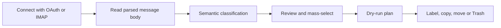

# Inbox Intelligence Organizer

A local, review-first email organizer for Gmail, Microsoft 365/Outlook, Yahoo Mail, and standards-compliant IMAP accounts. It reads the parsed message body, asks a semantic language model to classify the message's actual intent, and lets you review and bulk-label, move, copy, or move messages to Trash.

This application deliberately does **not** extract browser cookies, silently enter an account, or permanently erase mail. Gmail and Microsoft use their official OAuth flows. Yahoo and generic IMAP use an app password. Moving to Trash is recoverable until the provider empties Trash.

## The problem I wanted to solve

Bulk mailbox rules are quick until a useful message contains the same words as a rejection or an
advertisement. This tool reads the current message, quoted history and headers together, shows its
reasoning, and waits for review. The workflow is intentionally simple:



The destructive recommendation is narrow on purpose:

```python
if (
    classification.category in {Category.JOB_REJECTION, Category.PROMOTION_AD}
    and classification.confidence >= 0.95
    and not classification.protected
):
    return Action.TRASH
return Action.KEEP
```

## What it classifies

- Job rejection / unsuccessful application
- Promotion or advertisement
- Newsletter
- Recruiter response or action required
- Interview or job offer
- Receipt or financial message
- Security or account message
- Personal message
- Other / uncertain

The classifier evaluates the subject, sender, recipients, headers, and parsed body. It does not fall back to destructive keyword rules. Quoted reply history, signatures, advertising inside legitimate receipts, and phrases such as “you were not rejected” are called out in the model instructions. Attachments are never sent to the classifier. For unusually long messages, the beginning and end are retained within a 60,000-character context cap.

## Safety model

- Every scan opens in a review table; nothing is changed automatically.
- Only job rejections and promotions at 95% or greater confidence are suggested for Trash.
- Offers, interviews, recruiter actions, receipts, security, personal, uncertain, and low-confidence messages are protected.
- Protected messages require an explicit per-run override and a stronger confirmation phrase.
- The application implements **move to Trash**, not permanent deletion.
- A metadata-only JSONL audit log is written locally. It contains a hash of the message ID, never its subject or body.
- A dry-run CSV can be downloaded before applying changes.

Start with 50–100 messages and inspect the results before applying anything. No AI classifier is perfect.

## Install and run

Python 3.11 or newer is required.

### Windows

Open PowerShell in this folder:

```powershell
.\setup.ps1
.\run.ps1
```

If PowerShell blocks local scripts, run them explicitly for this session:

```powershell
powershell -ExecutionPolicy Bypass -File .\setup.ps1
powershell -ExecutionPolicy Bypass -File .\run.ps1
```

### macOS or Linux

```bash
bash setup.sh
bash run.sh
```

The app opens at `http://localhost:8501`.

## Choose the semantic model

### Local Ollama — recommended for privacy

1. Install Ollama from its official site.
2. Run `ollama pull llama3.2:3b`.
3. Leave the app's model settings at their defaults.

The message text stays on your machine. A larger compatible local model may classify nuanced mail more accurately if the computer has sufficient RAM.

### Remote OpenAI-compatible endpoint

Choose **Remote OpenAI-compatible** in the sidebar and provide the base URL, model name, and API key. The parsed message text is sent to that service. Confirm that this complies with your employer's policies before using it on work mail.

## Connect an email account

### Gmail

1. Create or select a Google Cloud project.
2. Enable the Gmail API.
3. Configure the OAuth consent screen.
4. Create an OAuth client with application type **Desktop app**.
5. Download the client JSON file.
6. In the app, choose Gmail, upload that JSON, and click **Connect Gmail**.
7. A browser opens for account selection and explicit consent. An already signed-in Google account may be offered, but the app never reads browser cookies itself.

The app requests `gmail.modify`, which is needed to read messages and change labels or move messages to Trash. Google classifies this as a restricted scope. A personal test-mode app can be used locally; distributing the app publicly can require Google verification and additional data-handling obligations.

### Microsoft 365 / Outlook

1. In Microsoft Entra, register a public-client/desktop application.
2. Add the delegated Microsoft Graph permission `Mail.ReadWrite`.
3. Enable public client flows if required by the tenant.
4. Copy the Application (client) ID into the app. Use your tenant ID, or `common` for accounts permitted by the registration.
5. Click **Connect Microsoft** and complete the interactive OAuth flow.

An organization's administrator may restrict user consent. The Trash action calls Microsoft Graph's message `move` operation with the well-known `deleteditems` folder.

### Yahoo Mail

1. In Yahoo account security, create an app password.
2. Choose Yahoo/IMAP in the app.
3. Use host `imap.mail.yahoo.com`, port `993`, SSL enabled, your full Yahoo address, and the app password.

Do not enter the ordinary Yahoo password. The app password is kept only in the current Streamlit session.

### Other IMAP providers

Enter the provider's IMAP hostname, SSL port, username, and app password. Folder naming and server capabilities differ. The tool uses UID MOVE when supported; otherwise it copies first and marks the original deleted without issuing an explicit EXPUNGE. Verify behavior with a test message before a bulk operation.

## Recommended workflow

1. Connect one account.
2. Select a folder and scan no more than 100 messages initially.
3. Review every suggested Job Rejection and Promotion item.
4. Open suspicious rows in the message preview.
5. Filter by category, use **Select every visible message** for mass selection, and uncheck exceptions.
6. Download the dry-run plan.
7. Choose Label/Category, Move, Copy, or Move to Trash.
8. Type the exact confirmation phrase shown by the app and apply.
9. Check the provider's Trash and restore mistakes promptly.

For a very large mailbox, repeat in batches. Gmail and Microsoft APIs can throttle requests, and local inference speed depends on the selected model and computer.

## Local files and secrets

- OAuth tokens and uploaded Gmail credentials are placed under `.private/` and excluded by `.gitignore`.
- Audit records are placed under `audit/` and excluded by `.gitignore`.
- Passwords and remote API keys are not written by the app.
- Do not share `.private/`, `.env`, OAuth tokens, app passwords, or audit files.

## Run the automated checks

```powershell
.\.venv\Scripts\python.exe -m unittest discover -s tests -v
```

On macOS/Linux:

```bash
.venv/bin/python -m unittest discover -s tests -v
```

## Important limitations

- Semantic classification reduces the weaknesses of keyword-only filters but cannot guarantee correctness.
- Attachments, images, and password-protected content are not classified.
- The tool is not an unattended deletion service; a human must review and confirm each batch.
- Provider Trash retention policies still apply. Restore mistakes before the provider permanently empties Trash.
- Consumer and enterprise accounts can impose OAuth, API, retention, legal-hold, or administrator restrictions.

See `SOURCES.md` for the official provider documentation used for the implementation.
