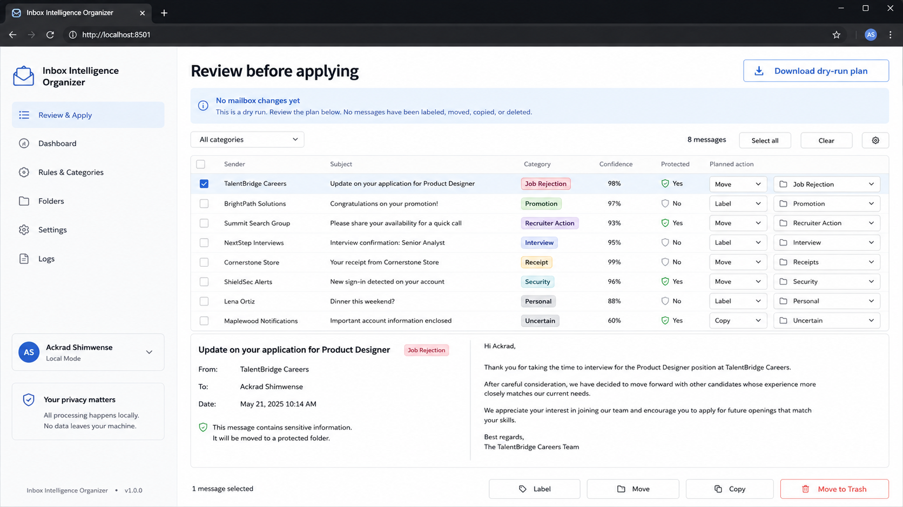
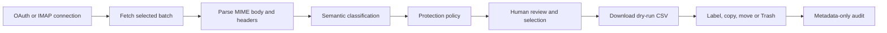

# Inbox Intelligence Organizer

**Built by Ackrad Shimwense**

Inbox Intelligence Organizer is a local, review-first application for classifying and bulk-organizing Gmail, Microsoft 365/Outlook, Yahoo and standards-compliant IMAP mailboxes. It reads the actual parsed message—not only the subject line—and turns a crowded inbox into a review table before any account change is allowed.



*The screen above uses fictional messages. It demonstrates the review and dry-run workflow without exposing a real mailbox.*

## Project summary

| Problem | Product response |
|---|---|
| Thousands of low-value messages consume attention and storage | Scan in manageable batches and group by meaning |
| Keyword rules misclassify receipts, replies and negated statements | Classify the parsed body, headers and quoted context semantically |
| Bulk deletion is risky | Default to protected, show a dry-run plan and move to Trash only after confirmation |
| Providers use different APIs | One provider interface for Gmail, Microsoft Graph and IMAP |
| Users need evidence of what changed | Local metadata-only audit log with hashed message IDs |

## Why I built it

Most email cleanup tools are either manual or too aggressive. A message can contain “unfortunately” without being a rejection, advertising can appear below a valid receipt, and a recruiter response should not be thrown away because it resembles a campaign email.

I wanted a tool that could understand the message's purpose, protect ambiguous or important mail, and still make mass selection practical. The result is useful for professionals, recruiters, job seekers, small businesses and anyone managing several long-lived accounts.

## How it works



Nothing happens automatically after classification. The user filters the table, previews messages, selects rows, downloads the plan and types the shown confirmation phrase.

## Categories

- Job rejection / unsuccessful application
- Promotion or advertisement
- Newsletter
- Recruiter response or action required
- Interview or offer
- Receipt or financial message
- Security or account message
- Personal message
- Other or uncertain

## Code behind the safety model

### Low-confidence and important categories are protected

```python
classification = Classification(
    category=Category(payload["category"]),
    confidence=float(payload["confidence"]),
    rationale=str(payload.get("rationale", "")),
    protected=bool(payload.get("protected", False)),
    evidence=list(payload.get("evidence", [])),
    model=model,
)

if classification.confidence < 0.90:
    classification.protected = True

if classification.category not in {
    Category.JOB_REJECTION,
    Category.PROMOTION_AD,
    Category.NEWSLETTER,
}:
    classification.protected = True
```

### Classification failure becomes a safe result

```python
for message in messages:
    try:
        classification = classifier.classify(message)
    except Exception:
        classification = conservative_fallback(message)
    results.append((message, classification))
```

The fallback never recommends deletion. It marks the message protected and explains that the semantic classifier was unavailable.

### Destructive recommendations are narrow

```python
if (
    classification.category in {
        Category.JOB_REJECTION,
        Category.PROMOTION_AD,
    }
    and classification.confidence >= 0.95
    and not classification.protected
):
    return Action.TRASH
return Action.KEEP
```

“Trash” means a recoverable provider Trash/Deleted Items operation, not permanent erasure.

## Provider architecture

```text
src/inbox_organizer/
├── classifier.py          # semantic model request and strict JSON parsing
├── mime.py                # message-body extraction and quoted-content handling
├── policy.py              # protection and action rules
├── engine.py              # batch classification and operation execution
├── audit.py               # privacy-preserving action record
└── providers/
    ├── gmail.py           # Gmail API and OAuth
    ├── microsoft.py       # Microsoft Graph and OAuth
    ├── imap.py            # Yahoo and generic IMAP
    └── base.py            # shared provider contract
```

## Technology used

- Python 3.11+
- Streamlit for the local review interface
- Gmail API with `gmail.modify`
- Microsoft Graph with delegated `Mail.ReadWrite`
- IMAP over SSL with UID MOVE/copy fallback
- Local Ollama or an OpenAI-compatible endpoint for semantic classification
- MIME parsing, JSONL audit records and dry-run CSV generation
- OAuth token storage under a Git-ignored `.private` directory
- Cross-platform PowerShell and shell launchers

## Install and run

Windows:

```powershell
.\setup.ps1
.\run.ps1
```

macOS/Linux:

```bash
bash setup.sh
bash run.sh
```

The app opens at `http://localhost:8501`. Start with 50–100 messages, inspect the classifications and test one recoverable operation before processing a larger batch.

## Authentication choices

- **Gmail:** desktop OAuth client JSON and browser consent.
- **Microsoft 365/Outlook:** Entra public-client registration and delegated Graph permission.
- **Yahoo:** IMAP app password, not the ordinary account password.
- **Other IMAP:** provider host, SSL port and app password.

Uploaded credentials and OAuth tokens remain under `.private/`; audit records remain under `audit/`. Both directories are excluded from Git.

## Proof and verification

```powershell
.\.venv\Scripts\python.exe -m unittest discover -s tests -v
```

The current implementation passes **12 automated tests** covering message models, classification parsing, protection rules, batch behavior and auditing. Provider calls still require a real account and the corresponding OAuth/app-password setup.

## What I would build next

- Add attachment text extraction behind a separate opt-in control.
- Add user feedback so corrected classifications improve a local model.
- Add duplicate-thread and large-attachment storage reports.
- Add scheduled scans that create a plan but never apply it unattended.
- Add provider-specific restore checks after a Trash operation.
- Package signed desktop installers for Windows, macOS and Linux.

## Important operating limit

Semantic classification is helpful, not infallible. The application is deliberately designed around human review, recoverable actions and small initial batches. Enterprise retention, legal hold and administrator policies still apply.

